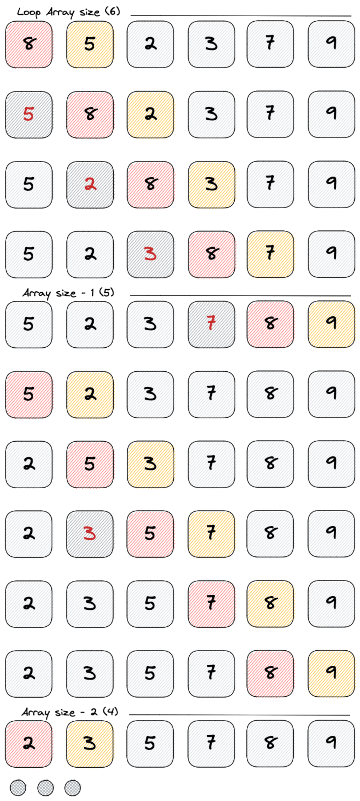

# Bubble sort
O bubble sort é um dos algoritmos mais simples, consiste em percorrer as
posições partindo do índíce zero (primeira posição) até o ultimo índice.

Compara os pares de elementos adjacentes e os troca de lugar se estiverem na
ordem errada. Esse processo se repetirá até que mais nenhuma troca seja
necessária.

## Performance
- Melhor caso: O(N)
- Pior caso: O(Nˆ2)
- Não é recomendado para grandes conjuntos de dados

## Exemplo
Obs: Esse algoritmo pega o maior elemento da parte não ordenada e vai carregando
ele até a última posição, ou seja, não preciso mais percorrer até o final do
vetor.

No exemplo abaixo, mesmo que o vetor começasse em 8. Na primeira iteração ele
iria parar na última posição.
