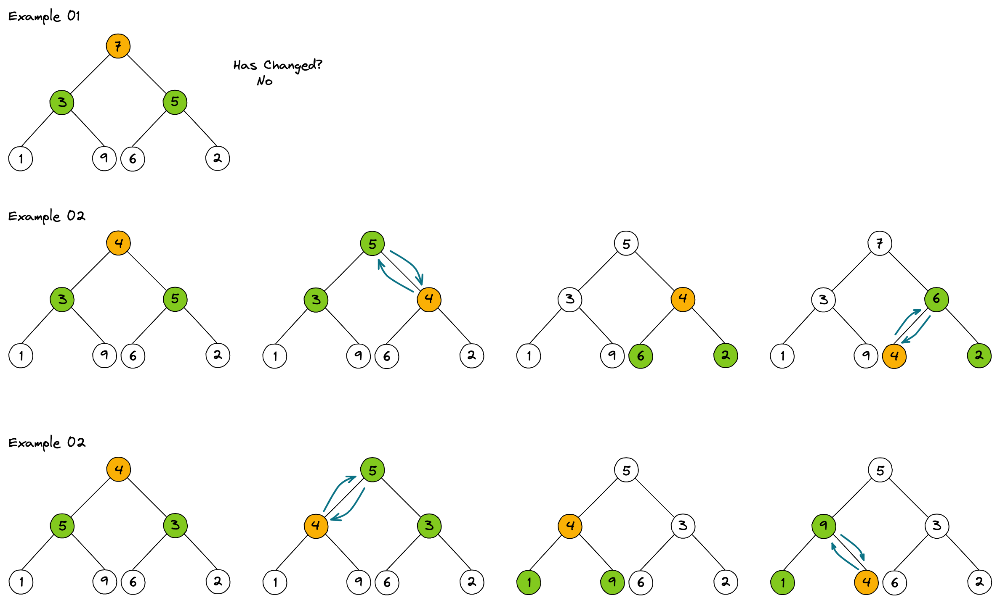
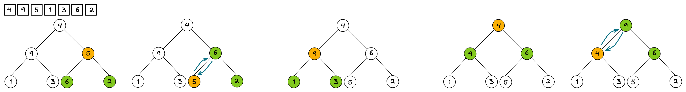
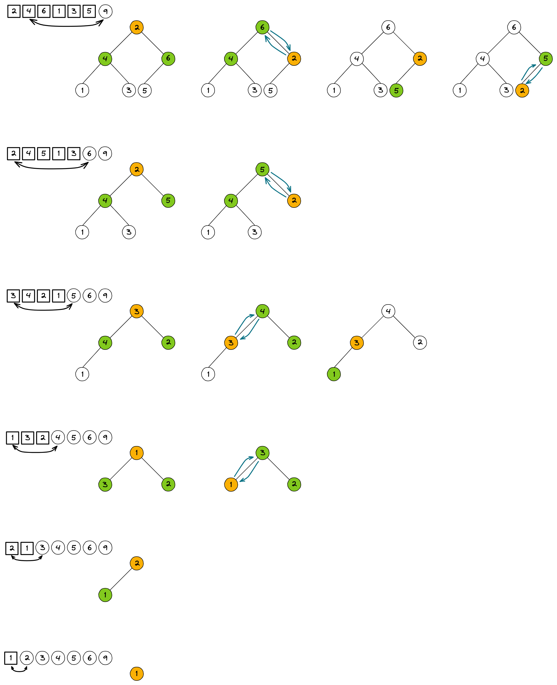

# Heap sort
O heap sort é um algoritmos de ordenação similar ao de seleção. Simulando uma
arvore binárias, envia sempre o maior número para raíz e em seguida troca de lugar
com a última posição do vetor. O processo se repete `n` vezes (tamanho do array).

## Exemplo
Heapfy

HeapSort todos os nós de trás pra frente utilizando o Heapfy.

Executando o Heapsort `size - 1` vezes, substituindo o primeiro com o último
elemento e chamando o heapify novamente para trazer até a raíz o maior elemento.
