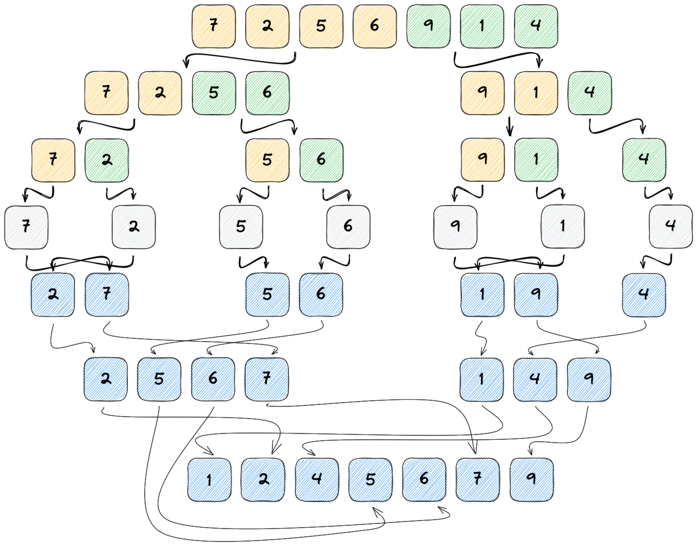

# Merge sort
O merge sort é um algoritmos de Dividir e Conquistar, ou seja, ir dividindo o
problema em problemas menores até que não seja mais possível dividi-lo. Depois
resolve-os combinando até que chegue no solução final do problema.

É um dos melhores algoritmos de ordenação, basicamente quebra a lista
recursivamente até que sobre um único elemento. Combina as duas sub-listas com
o objetivo de uma sub-lista maior e ordenada até que chegue na lista final.

## Performance
- Melhor caso: O(N log N);
- Pior caso: O(N log N);
- Eficiente para conjuntos pequenos de dados;
- Estável: não altera a ordem de dados iguais;
- Desvantagem: ele é recursivo e usa um vetor auxiliar durante a ordenação.

## Exemplo
