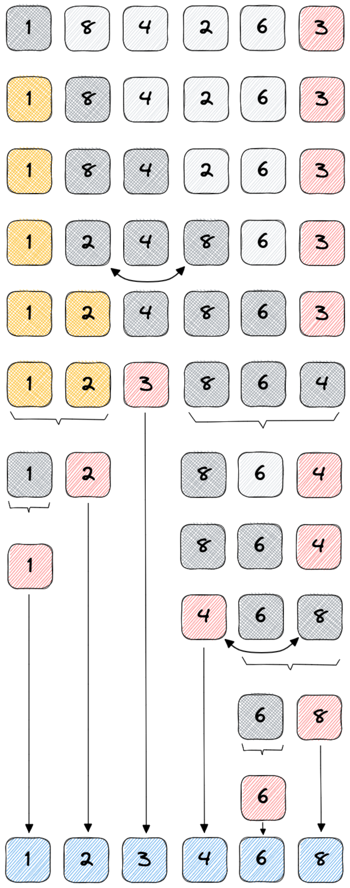

# Quick sort
O quick sort é um algoritmos de Dividir e Conquistar, ou seja, ir dividindo o
problema em problemas menores até que não seja mais possível dividi-lo. Depois
resolve-os combinando até que chegue no solução final do problema.

O quick-sort se baseia no particionamento, que basicamente significa escolher
uma posição qualquer no array, chamado de pivot. Em seguida, posicionar todos
elementos menores a esquerda e os maiores a direita.

Não podemos garantir que os elementos da esquerda e da direita estão ordenados,
porém, podemos afirmar que em relação ao pivot sim. Sendo assim, ao chamarmos o
particionamento para o array da esquerda e para o array da direita recursivamente
cada subsequência terá novos pivots e fará com que os problemas sejam quebrados
em problemas menores.

Existem diferentes versões do quick-sort em relação a selecionar o pivot.
- Sempre pegar o primeiro elemento
- Sempre pegar o ultimo elemento
- Pegar o elemento aleatoriamente
- Pegar a mediana

## Performance
- Melhor caso: O(N log N);
- Pior caso (raro): O(Nˆ2);
- Estável: não altera a ordem de dados iguais;
- Desvantagem: Como escolher o melhor pivot?

## Exemplo
