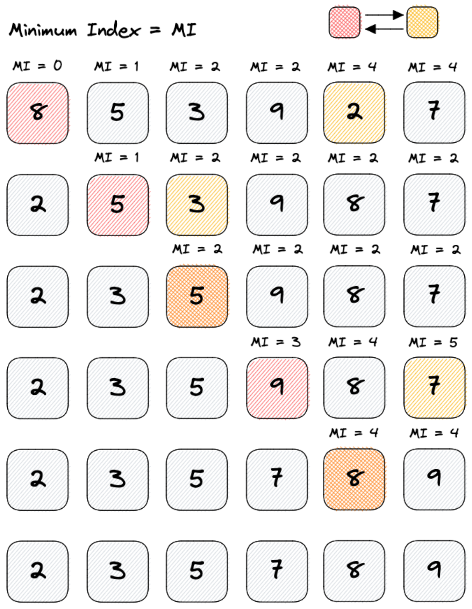

# Selection sort
O Selection sort é um dos algoritmos mais simples, consiste em percorrer o array
procurando pelo menor valor possível. Se encontrado, troca-os de lugar, enviando
o menor valor para primeira posição.

Em seguida, percorre novamente todo o array procurando pelo próximo valor
possível. Ao encontra-lo, envia-o para segunda posição e assim sucessivamente.

## Performance
- Melhor caso: O(N^2)
- Pior caso: O(Nˆ2)
- Ineficiênte para grandes conjuntos de dados;
- Estável: não altera a ordem de dados iguais.

## Exemplo
